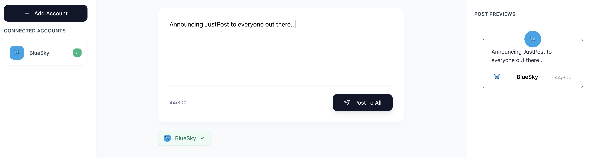

# Just Post

*The fastest way to broadcast your message across all your social platforms. No frills, no setup. Just post.*



---

### Philosophy & Core Idea

In a world of complex social media management tools with schedulers, analytics, and team features, **Just Post** takes a radically simple approach. It is built for founders, creators, and entrepreneurs who need to get an idea from their head to their audience as quickly as humanly possible.

This tool is intentionally not trying to be a social media suite. It does one thing and does it well: it posts your content to multiple networks at once. It's about a frictionless, immediate broadcast.

### Key Features

* **Multi-Platform Broadcasting:** Write once, post everywhere you're logged in. The goal is to support platforms like BlueSky, Twitter/X, Threads, LinkedIn, and more.
* **Live Platform Previews:** As you type, see exactly how your post will be rendered on each platform. Instantly be aware of character limits, truncation, and formatting differences so you can adjust on the fly.
* **Selective Posting:** Easily toggle which platforms you want to post to for any given message with a single click.
* **100% Client-Side:** Just Post runs entirely in your browser. There is no backend server, no database, and no app-level account required. Your credentials and data are handled directly between your browser and the social platforms.
* **Direct Authentication:** You authenticate directly and securely with each social media platform using their official OAuth login flows. This app never sees or stores your passwords.

### Tech Stack

* **Framework:** [React](https://react.dev/)
* **Build Tool:** [Vite](https://vitejs.dev/)
* **Styling:** [Tailwind CSS](https://tailwindcss.com/)
* **Icons:** [Lucide React](https://lucide.dev/)

### How It Works: The Serverless Approach

The goal is for Just Post to run without a dedicated backend, which simplifies deployment and enhances user privacy. This is possible by leveraging modern web standards:

1.  **Client-Side Application:** The app is a Single-Page Application (SPA) that is fully downloaded to the user's browser.
2.  **OAuth for Public Clients (PKCE):** For platforms that support it (like Twitter/X and LinkedIn), the app uses the **OAuth 2.0 Authorization Code Flow with PKCE**. This flow is specifically designed for public clients (like browser-based apps) to securely obtain access tokens without needing a secret client key, which would otherwise require a server to protect.
3.  **Direct API Interaction:** Once a user has authenticated, the application holds the access token in the browser session and makes API calls directly from the client to the respective platform's API to create a post.

### Getting Started

To run the project locally:

1.  **Clone the repository:**
    ```bash
    git clone [https://github.com/your-username/just-post.git](https://github.com/your-username/just-post.git)
    cd just-post
    ```

2.  **Install dependencies:**
    ```bash
    npm install
    ```

3.  **Run the development server:**
    ```bash
    npm run dev
    ```
    The app will be available at `http://localhost:5173` (or another port if 5173 is in use).

### Roadmap

This project is in its early stages. Future ideas include:

* [ ] Adding support for more platforms (Threads, LinkedIn, Mastodon).
* [ ] Image and media uploads.
* [ ] Basic threading support (e.g., creating a multi-post thread for BlueSky or X).
* [ ] Link attachment previews.

### Contributing

This is a passion project, and contributions are welcome! If you have ideas for features or improvements, please open an issue to discuss what you would like to change.